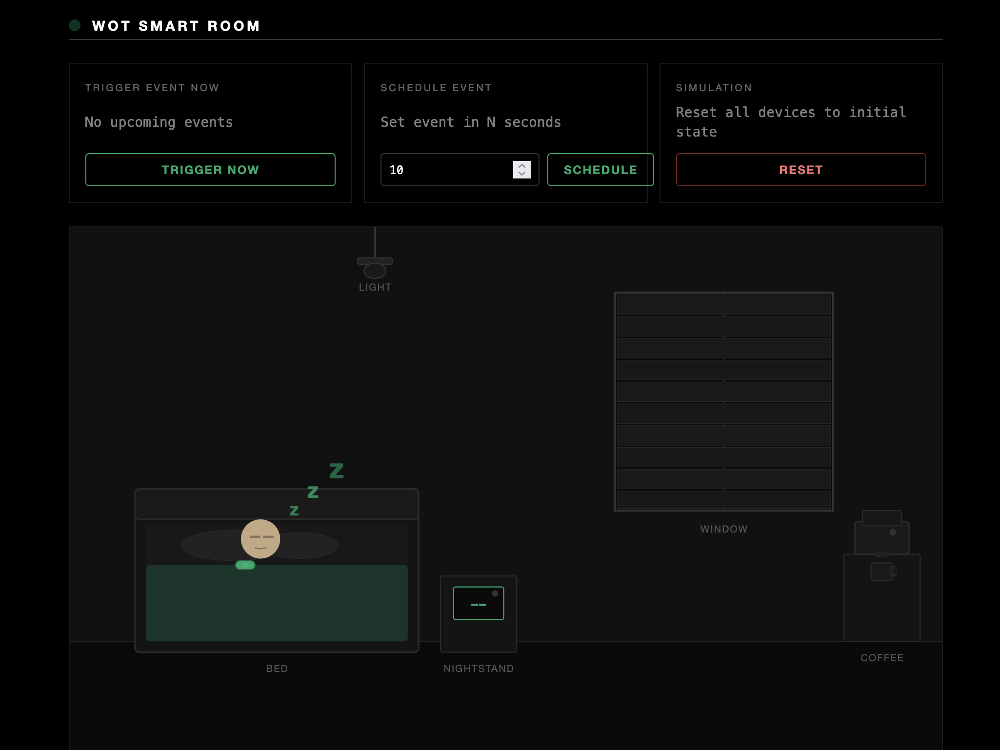

# Exercise 4: BDI Agents and Agents on the Web

**University of St.Gallen** — Institute of Computer Science

**Course:** Web-based Autonomous Systems, FS2026

**Instructors:** Jan Grau, Alessandro Giugno, Andrei Ciortea

**Contact:** janerik.grau@student.unisg.ch

**Deadline: March 17, 2025; 23:59 CET**

---

In this exercise, you will gain hands-on experience in programming BDI agents and artifacts using Jason and CArtAgO (part of the JaCaMo platform). You will:

1. Complete a warm-up exercise to review the basics of the Jason/AgentSpeak language (optional);
2. Program a BDI agent in AgentSpeak to maintain a target illuminance level in a room;
3. Program a SchedulingArtifact artifact in Java, and BDI agents that use it to schedule and manage trains rides;
4. Program a BDI agent that interacts with devices in its environment using [W3C Web of Things (WoT) Thing Descriptions](https://www.w3.org/TR/wot-thing-description11/) to assist a user through their daily activities.

---

## Project Structure

```
├── wot-servient
│   ├── server.js               // WoT servient simulating smart room devices
│   ├── dashboard.html           // Dashboard for observing device states
│   └── tds
│       ├── wristband.ttl        // Thing Description of the wristband
│       ├── event-portal.ttl     // Thing Description of the event portal
│       ├── blinds.ttl           // Thing Description of the blinds
│       ├── lights.ttl           // Thing Description of the lights
│       ├── mattress.ttl         // Thing Description of the mattress
│       └── coffee-machine.ttl   // Thing Description of the coffee machine
├── src
│   ├── agt
│   │   ├── warmup
│   │   │   └── simple_agent.asl           // Agent program for Warm-up
│   │   ├── task1
│   │   │   └── illuminance_controller.asl // Agent program for Task 1
│   │   ├── task2
│   │   │   ├── train_operator.asl         // Agent program for Task 2
│   │   │   ├── train_driver.asl           // Agent program for Task 2
│   │   │   └── train_controller.asl       // Agent program for Task 2
│   │   └── task3
│   │       ├── personal_assistant.asl     // Agent program for Task 3
│   │       └── barista.asl                // Agent program for Task 3
│   └── env
│       ├── task1
│       │   ├── IlluminanceSensor.java // Artifact: illuminance sensor
│       │   ├── LightBulb.java         // Artifact: light bulb
│       │   ├── Blinds.java            // Artifact: blinds
│       │   └── WeatherStation.java    // Artifact: weather station
│       └── task2
│           └── SchedulingArtifact.java // Artifact: beat-based scheduler
├── warmup.jcm   // JaCaMo configuration for Warm-up
├── task1.jcm    // JaCaMo configuration for Task 1
├── task2.jcm    // JaCaMo configuration for Task 2
├── task3.jcm    // JaCaMo configuration for Task 3
└── build.gradle
```

---

## How to Run the Project

There are four ways to run the project. 

The available Gradle tasks are:
- For Warm-up: `warmup`
- For Task 1: `task1`
- For Task 2: `task2`
- For Task 3: `task3`

The WoT servient dashboard (for Task 3) is available at `http://localhost:5000`. The JaCaMo GUI is available at `http://localhost:6080` (via noVNC). Additionally, JaCaMo provides the following web-based inspectors:
- **Jason Mind Inspector** at `http://localhost:3272` — inspect agent beliefs, plans, and intentions
- **Moise Organisation Inspector** at `http://localhost:3271` — inspect the organisation state (not yet needed in this exercise)
- **CArtAgO Inspector** at `http://localhost:3273` — inspect workspaces and artifacts

### Option 1: Docker Compose

Runs everything (WoT servient + JaCaMo) in Docker containers. No local Java installation required.

```shell
# Build the containers (first time only)
docker compose build

# Run Warm-up (default)
docker compose up

# Run Task 1
TASK=task1 docker compose up

# Run Task 2
TASK=task2 docker compose up

# Run Task 3
TASK=task3 docker compose up
```

The `src/` directory and `.jcm` files are mounted as volumes, so you can edit them locally and restart to rerun:
```shell
docker compose down
docker compose up
```

<details>
<summary><strong>Option 2: VS Code Dev Container</strong></summary>

1. Install the [Dev Containers](https://marketplace.visualstudio.com/items?itemName=ms-vscode-remote.remote-containers) extension in VS Code
2. Open this project in VS Code
3. Click "Reopen in Container" when prompted (or run the command `Dev Containers: Reopen in Container`)
4. Wait for the container to build (first time only)
5. The VNC desktop and WoT servient start automatically
6. Run a task from the integrated terminal:
```shell
./run.sh task1
```
   This ensures the VNC server is running before launching JaCaMo. You can also use `./gradlew task1` directly if VNC is already running.

</details>

<details>
<summary><strong>Option 3: GitHub Codespaces</strong></summary>

1. Open this repository on GitHub
2. Click `Code` > `Codespaces` > `Create codespace on main`
3. Wait for the Codespace to build
4. The VNC desktop and WoT servient start automatically
5. Run a task from the terminal:
```shell
./run.sh task1
```

</details>

<details>
<summary><strong>Running locally</strong></summary>

If you have **Java 21** installed locally, you can run the project directly.

**1. Start the WoT servient (needed for Task 3 only):**

With Docker:
```shell
cd wot-servient
docker build -t wot-servient .
docker run -d --rm --name wot-servient -p 1180:1180 -p 5000:5000 wot-servient
```
To stop the container: `docker stop wot-servient`.

Or with Node.js:
```shell
cd wot-servient
npm install
npm start
```

**2. Run the JaCaMo application:**

- MacOS and Linux:
```shell
./gradlew task1
```
- Windows:
```shell
gradlew.bat task1
```
- In VSCode: Click on the Gradle Side Bar elephant icon, and navigate to `GRADLE PROJECTS` > `exercise-4` > `Tasks` > `JaCaMo` > `task1`.

</details>

---

## Documentation

- [Bordini, R. H., Hubner, J. F., & Wooldridge, M. (2007). *Programming multi-agent systems in AgentSpeak using Jason.* John Wiley & Sons.](https://www.wiley.com/en-gb/Programming+Multi+Agent+Systems+in+AgentSpeak+using+Jason-p-9780470029008); Chapters 1–3
- [Boissier, O., Bordini, R. H., Hubner, J., & Ricci, A. (2020). *Multi-agent oriented programming: programming multi-agent systems using JaCaMo.* MIT Press.](https://mitpress.mit.edu/9780262044578/); Chapters 3–7
- [CArtAgO by Exercises](https://github.com/cake-lier/cartago-by-exercises)
- [Default internal actions of Jason](https://www.emse.fr/~boissier/enseignement/maop12/doc/jason-api/jason/stdlib/package-summary.html)

---

## Warm-up (not graded): Getting Started with AgentSpeak

Complete the provided agent program of a simple agent ([`simple_agent.asl`](src/agt/warmup/simple_agent.asl), run the Gradle task `warmup`). This agent demonstrates basic AgentSpeak concepts including:

- **Arithmetic**: computing the sum of two numbers;
- **Division with error handling**: dividing two numbers with a guard for division by zero;
- **Inference rules**: determining whether a number is even or odd using `mod`;
- **Recursion with lists**: generating a list of integers in a range using the `|` bar operator.

The agent program contains commented-out plans and goals. Uncomment and implement each section step by step, running the agent after each change to verify your implementation. The reference solution is provided in [`simple_agent_solution.asl`](src/agt/warmup/simple_agent_solution.asl) (run the Gradle task `warmup_solution`).

---

## Task 1 (1.5 points): Illuminance Controller Agent

An illuminance controller agent ([`illuminance_controller.asl`](src/agt/task1/illuminance_controller.asl)) has the design objective of maintaining the illuminance in a room at a given target level by controlling the blinds and the lights. Study and run the provided agent program to understand the agent's behavior (run the Gradle task `task1`).

Note that the agent is capable of performing multiple external actions exposed by artifacts in the room, namely: `turnOnLights`, `turnOffLights`, `raiseBlinds`, `lowerBlinds`. Additionally, the agent may hold beliefs about its environment, namely:

- the illuminance level in the room measured in luminous flux per area unit (lux); e.g., a current illuminance of 0 lux can be represented as: `current_illuminance(0)`;
- the state of the lights in the room, which can be turned on or off and represented as: `lights("on")`, `lights("off")`;
- the state of the blinds in the room, which can be raised or lowered and represented as: `blinds("raised")`, `blinds("lowered")`;
- the weather conditions, which can be sunny or cloudy and represented as: `weather("sunny")`, `weather("cloudy")`.

Study and run the provided agent program to understand the agent's behavior. Then, update the implementation as follows[^1]:

1. Initially, the `current_illuminance` is 0 lux, and the `target_illuminance` is 400 lux. In order to increase the illuminance from 0 to 400, the agent turns on the lights. However, the program will then fail because the agent does not know how to handle the event `+!manage_illuminance` when the current illuminance is equal to the target illuminance. **Write a plan** that handles this case by printing a message that the design objective has been achieved.

2. Although the agent successfully maintains the illuminance at the target level, it does not achieve this using the most energy-efficient method, since, during sunny days, it can achieve the target level of 400 lux by raising the blinds instead of turning on the lights. **Update the program** so that the agent first tries to increase the illuminance by raising the blinds when the weather is sunny. You should now observe that initially the agent raises the blinds in sunny weather, but it also turns on the lights if the weather becomes cloudy.

3. Now the agent successfully manages the illuminance in a more energy-efficient manner in both sunny and cloudy weather. However, if the agent increased the illuminance in the past by raising the blinds, and now the weather is cloudy, the blinds remain unnecessarily raised. **Write a plan** that enables the agent to react to the deletion of the belief `weather("sunny")` by lowering the blinds if the blinds are currently raised.

4. Decrease the `target_illuminance` from 400 to 350 lux. Now the agent is stuck in a loop, turning on and off the lights because it cannot maintain the illuminance at the exact target level. **Update the inference rules** `requires_darkening` and `requires_brightening` so that the predicates are inferred as true only if the current illuminance differs by ±100 (respectively) from the target illuminance. The agent should now avoid the hysteresis phenomenon, considering that the illuminance is maintained close to the target level of 350 lux when either the blinds are raised or the lights are turned on.

### Expected System Behaviour

- **Step 1**: The agent turns on the lights, illuminance reaches 400 lux, and the agent prints that the design objective has been achieved. No errors or plan failures occur.
- **Step 2**: In sunny weather, the agent raises the blinds instead of turning on the lights. When the weather changes to cloudy, the agent turns on the lights.
- **Step 3**: When the weather changes from sunny to cloudy, the agent automatically lowers the blinds (in addition to turning on the lights).
- **Step 4**: With `target_illuminance(350)`, the agent no longer oscillates between turning lights on and off. It stabilizes and repeatedly prints that the design objective is achieved.

---

## Task 2 (2.5 points): Train Scheduling with the SchedulingArtifact

> **Want to dive deeper into CArtAgO?** Check out [cartago-by-exercises](https://github.com/cake-lier/cartago-by-exercises) for additional hands-on exercises.

In this task, you will program a `SchedulingArtifact` in Java and write agents that use it in a train scheduling scenario. Three agents collaborate to manage a train ride from St. Gallen to Bern:

- **`train_operator`**: schedules train rides by setting reminders on the `SchedulingArtifact`;
- **`train_driver`**: listens for train rides, drives the train, announces the upcoming arrival, and communicates the end of the ride;
- **`train_controller`**: monitors the train ride, periodically checks on guests, and handles the end of the ride.

All three agents share a single `SchedulingArtifact` in a common workspace. The artifact beats every second and provides two operations:

- **`setReminder(propName, value, beats)`**: after the specified number of beats (seconds), adds an observable property with the given name and value. The observing agent perceives this as a new belief.
- **`setRecurrentReminder(propName, value, beats)`**: every N beats (seconds), adds/re-adds an observable property with the given name and value. The agent gets re-notified each cycle.

Run the Gradle task `task2` to test your implementation.

### Task 2.1: Programming the SchedulingArtifact

Complete the implementation of the `SchedulingArtifact` ([`SchedulingArtifact.java`](src/env/task2/SchedulingArtifact.java)):

1. **Implement `setReminder`**[^2][^3]: This `@OPERATION` should launch an `@INTERNAL_OPERATION` that waits for the given number of beats, then creates an observable property using `defineObsProperty(propName, value)`.

2. **Implement `setRecurrentReminder`**[^2][^3]: This `@OPERATION` should launch an `@INTERNAL_OPERATION` that repeatedly waits for the given number of beats, then removes and re-defines the observable property (to re-notify the agent).

Hints:
- Use `@OPERATION` for operations callable by agents, `@INTERNAL_OPERATION` for internal async operations.
- Use `execInternalOp("opName", args...)` to launch an internal operation from an `@OPERATION`.
- Use `getObsProperty(name)` to check if a property exists (returns `null` if not).
- Use `removeObsProperty(name)` to remove an observable property before re-defining it.

### Task 2.2: Creating the Artifact from Agent Code

In the previous tasks, artifacts were pre-defined in the `.jcm` project file. In this task, the `SchedulingArtifact` is **not** pre-configured in the workspace — instead, one of the agents must create it programmatically at startup.

Complete the `+!start` plan of the train controller agent ([`train_controller.asl`](src/agt/task2/train_controller.asl)) so that the agent:

1. **Creates** the `SchedulingArtifact` using `makeArtifact`;
2. **Focuses** on the artifact so the agent can observe its properties (belief updates).

The other agents (`train_driver`, `train_operator`) will then look up the artifact by name using `lookupArtifact`. Once an agent has focused on an artifact, it can call the artifact's operations directly by name without needing to specify the artifact ID.

- **`makeArtifact(Name, ClassName, InitParams, ArtifactId)`**: creates a new artifact instance in the current workspace. `Name` is the artifact's name (a string), `ClassName` is the fully qualified Java class name, `InitParams` is a list of initialization parameters (use `[]` if none), and `ArtifactId` is the output variable for the artifact's ID.
- **`focus(ArtifactId)`**: subscribes the agent to the artifact's observable properties, so that changes are perceived as belief additions/deletions.

### Task 2.3: Train Operator Agent

Complete the implementation of the train operator agent ([`train_operator.asl`](src/agt/task2/train_operator.asl)):

- Use the `SchedulingArtifact` to **schedule a train ride to Bern** departing at time 5. Use `setReminder` to create a `train_ride` belief with value `"Bern"` after 5 beats.

### Task 2.4: Train Driver Agent

Complete the implementation of the train driver agent ([`train_driver.asl`](src/agt/task2/train_driver.asl)):

- When a `train_ride(Destination)` belief is added, the driver should use the `SchedulingArtifact` to:
  1. **Schedule an arrival announcement** 3 seconds before arrival (at time `Duration - 3`);
  2. **Schedule the end of the ride** at the arrival time (at time `Duration`).

The driver already has beliefs about travel durations (`travel_duration("Bern", 20)`, etc.) and plans to react to `announcement` and `end_ride` beliefs.

### Task 2.5: Train Controller Agent

Complete the implementation of the train controller agent ([`train_controller.asl`](src/agt/task2/train_controller.asl)):

- When a `train_ride(Destination)` belief is added, the controller should use the `SchedulingArtifact` to:
  1. **Set a recurrent reminder** to check guests every 2 seconds.

The controller already has plans to react to `guest_check` and `end_ride` beliefs.

### Expected System Behaviour

- **Task 2.1**: The `SchedulingArtifact` compiles and both `setReminder` and `setRecurrentReminder` work correctly — one-shot reminders fire once after the specified beats, recurrent reminders repeat every N beats.
- **Task 2.2**: The train controller creates the `SchedulingArtifact` at startup and focuses on it. The other agents can look it up by name.
- **Task 2.3**: After 5 seconds, a `train_ride("Bern")` belief appears and the train driver and controller react to it.
- **Task 2.4**: The train driver schedules an announcement 3 seconds before arrival and the end of the ride at the arrival time. You see "Announcing upcoming arrival to passengers" followed by "Arrived at Bern".
- **Task 2.5**: The train controller prints "Checking tickets and assisting guests" every 2 seconds while the ride is ongoing.

---

## Task 3 (6 points): Programming a BDI Agent

Your third task is to complete a JaCaMo application by programming a BDI agent in AgentSpeak. The agent is a personal assistant ([`personal_assistant.asl`](src/agt/task3/personal_assistant.asl)) whose design objective is to assist its user through their daily activities. Such is the case when the assistant believes that the user is asleep, and that the user has an upcoming event to attend. Considering its options, the assistant strives to wake up the user as gently as possible, e.g. by turning on the lights, raising the blinds, or setting the mattress to a vibration mode.

The assistant can monitor the state of the user and its environment by interacting with multiple WoT Things in the room via [ThingArtifacts](https://github.com/HyperAgents/jacamo-hypermedia/blob/main/lib/src/main/java/org/hyperagents/jacamo/artifacts/wot/ThingArtifact.java). Specifically, it can monitor:

- the **upcoming events** of the user through an event portal; e.g., an upcoming event that is about to start can be represented as: `upcoming_event("now")`;
- the **state of the user** as monitored by the user's wristband; e.g., the state of the user being awake or asleep can be represented as: `owner_state("awake")`, `owner_state("asleep")`;
- the **state of the lights** in the room, which can be turned on or off and represented as: `lights("on")`, `lights("off")`;
- the **state of the blinds** in the room, which can be raised or lowered and represented as: `blinds("raised")`, `blinds("lowered")`;
- the **state of the user's mattress** which can be in an idle mode or a vibrations mode and represented as: `mattress("idle")`, `mattress("vibrating")`.

The agent interacts with these devices through W3C WoT Thing Descriptions. The ThingArtifacts are pre-configured and **focused** in the [`.jcm` project file](task3.jcm) — each artifact wraps a Thing Description and exposes operations for interacting with the described Thing. The available artifacts are: `wristband`, `event_portal`, `lights`, `blinds`, `mattress`, `coffee_machine`.

Since the artifacts are focused via the `.jcm` file, the agent automatically has `focused(WorkspaceName, ArtifactName, ArtifactId)` beliefs. Use these to retrieve artifact IDs when needed (e.g., to disambiguate which ThingArtifact to target with `invokeThingAction`):

```prolog
?focused(workspace_name, artifact_name, ArtifactId);
```

<details>
<summary><strong>ThingArtifact API</strong></summary>

The `ThingArtifact` serves as a **generic browser for WoT Things**. Much like a web browser provides a uniform interface for navigating any website, regardless of what the site does, the `ThingArtifact` provides a uniform developer experience for interacting with any Thing, regardless of what device it represents. Without it, you would need to write a custom CArtAgO artifact (Java class) for each device: one for the lights, one for the blinds, one for the mattress, and so on, each with its own hardcoded HTTP calls, URL handling, and payload parsing. The `ThingArtifact` eliminates this by interpreting the Thing Description at runtime and exposing a small set of generic operations (`readThingProperty`, `observeThingProperty`, `invokeThingAction`, `getThingActionPayload`) that work with any Thing. Switching from a local test servient to a production deployment is simply a matter of changing the Thing Description URL in the `.jcm` configuration. No agent code needs to change.

**`readThingProperty(URI, Output)`** — Read a property value (one-shot). The output is a list; use `.nth(0, List, Value)` to extract the first element.
```prolog
?focused(workspace_name, artifact_name, ArtifactId);
readThingProperty("https://example.org/ontology#SomeProperty", ResultLst) [artifact_id(ArtifactId)];
.nth(0, ResultLst, Value)
```

**`observeThingProperty(URI, BeliefName)`** — Subscribe to an observable property. Creates a CArtAgO observable property with the given name that is automatically kept up-to-date (via HTTP long-polling). The agent can then react to changes with a plan triggered by `+BeliefName(Value)`.
```prolog
observeThingProperty("https://example.org/ontology#SomeProperty", "my_belief") [artifact_id(ArtifactId)]
```
The agent can then react to changes:
```prolog
+my_belief("some_value") : true <- .print("Value changed!").
```

**`invokeThingAction(URI, Payload)`** — Invoke an action on a Thing.
```prolog
invokeThingAction("https://example.org/ontology#SomeAction", ["value"]) [artifact_id(ArtifactId)]
```

**`getThingActionPayload(URI, Description)`** — Get a human-readable description of the expected input for an action (useful for introspection).
```prolog
getThingActionPayload("https://example.org/ontology#SomeAction", Description) [artifact_id(ArtifactId)];
.print("Expected payload: ", Description)
```

See the Thing Descriptions in [`wot-servient/tds/`](wot-servient/tds/) for the available property and action affordances (URIs, allowed values, etc.).

</details>

Complete the implementation of the agent program [`personal_assistant.asl`](src/agt/task3/personal_assistant.asl) to enable the agent to wake up the user in case there are any upcoming events (run the Gradle task `task3`):

1. Write plans so that the assistant **reacts to the addition of the belief `upcoming_event("now")`**. If the user is awake, the assistant should print `"Enjoy your event"`. If the user is asleep, the assistant should print `"Starting wake-up routine"`.

2. Update the agent program so that, when initialized, the assistant holds beliefs about **how the user prefers to be woken up** (the most preferred method is assigned the lowest rank):
   - the user ranks waking up with artificial light with a **2**;
   - the user ranks waking up with natural light with a **1**;
   - the user ranks waking up with its mattress' vibration mode with a **0**.

   Additionally, write an **inference rule** that enables the assistant to infer what is the `best_option(Option)` for waking up the user based on the available rankings. E.g. based on the current rankings, only `best_option(vibrations)` should be inferred as true, while corresponding predicates for the other wake-up methods should be inferred as false.

3. Write plans that enable the assistant to **achieve the goal of waking up the user**. The agent should wake up the user based on the current `best_option`. E.g. if `best_option(vibrations)` is true, the agent should set the mattress to vibrating mode. The agent should continue striving for waking up the user for as long as the user is considered to be asleep, and print a message that the design objective has been achieved if the user is now considered to be awake. Update your implementation from step 1 so that the agent creates the goal of waking up the user when there is an upcoming event and the user is asleep. You should observe that the agent attempts waking up the user by setting the mattress to the vibrations mode, but the user remains asleep.

4. Update the agent program so that the agent **takes note of any methods that it has already used** in its attempt to wake up the user. Additionally, update the program so that the `best_option` is now selected only among the non-used methods. You should observe that the agent attempts to wake up the user first by setting the mattress to the vibrations mode, then, by raising the blinds, and finally, by turning on the lights. By employing all these methods, you should observe that the user is now awake.

5. The event portal can also signal events that are upcoming in N seconds, represented as `upcoming_event(N)` where N is a number greater than 0. **Write a plan** that reacts to the addition of `upcoming_event(N)` when N is a number, and uses the `SchedulingArtifact` (the `scheduler` artifact, already focused via the `.jcm` file) to schedule a reminder so that `upcoming_event("now")` is added after N beats (seconds). This way, the agent's existing plans for `upcoming_event("now")` will be triggered at the right time. You can test this by setting the event to a number (e.g. 10) on the dashboard instead of "now". *Hint:* use `.number(N)` in the plan context to ensure the plan only matches numeric values and not the string `"now"`.

You can observe the effects of your agent's actions on the dashboard at `http://localhost:5000`. Use the dashboard to trigger an event ("now" or a number) and press "Reset" to restart the scenario (does not restart the JaCaMo beliefs though). You can also trigger events directly from the website by clicking the "Trigger Now" button or scheduling them for a specific number of seconds using the "Schedule" button.



### Expected System Behaviour

- **Step 1**: When you trigger an event ("now") on the dashboard, the agent prints `"Enjoy your event"` if the user is awake, or `"Starting wake-up routine"` if the user is asleep.
- **Step 2**: The agent has initial beliefs `rank(vibrations, 0)`, `rank(natural_light, 1)`, `rank(artificial_light, 2)` and an inference rule so that `best_option(vibrations)` is inferred as true.
- **Step 3**: After triggering an event while the user is asleep, the agent sets the mattress to vibrating mode, waits, and retries. The user remains asleep but no errors occur.
- **Step 4**: The agent tries vibrations first, then raises the blinds, then turns on the lights (depending on your order). After all three methods, the user wakes up and the agent prints that the design objective is achieved. On the dashboard, you should see the mattress vibrating, blinds raised, and lights on.
- **Step 5**: When you set an event to a number (e.g. 10) on the dashboard, the agent schedules a reminder and the wake-up routine triggers after the specified number of seconds.

---

## Bonus Task (1 point): Barista Agent with Coffee Machine and Scheduling

This optional bonus task extends the Task 3 scenario by programming a second agent — a barista ([`barista.asl`](src/agt/task3/barista.asl)) — that manages the coffee machine and uses the `SchedulingArtifact` (from Task 2) for scheduling. The barista agent operates alongside the personal assistant in the same smart room (run the Gradle task `task3`).

The barista has access to the following artifacts (pre-configured in the [`.jcm` project file](task3.jcm)):
- **`coffee_machine`**: a ThingArtifact wrapping the coffee machine's Thing Description. Use `invokeThingAction` with the appropriate action URI to control it. See [`coffee-machine.ttl`](wot-servient/tds/coffee-machine.ttl) for available actions and allowed states.
- **`barista_scheduler`**: a `SchedulingArtifact` instance for the barista's own scheduling needs. Provides `setReminder` and `setRecurrentReminder` (same API as in Task 2).
- **`scheduler`**: the personal assistant's scheduler — the barista can focus on it to observe `upcoming_event` beliefs.

Complete the implementation of the barista agent ([`barista.asl`](src/agt/task3/barista.asl)):

1. **Set up a recurring cleaning schedule**: Use `setRecurrentReminder` on the `barista_scheduler` to trigger a `cleaning("needed")` belief every 30 seconds. When cleaning is needed, the barista should control the coffee machine through a cleaning sequence: set the state to `"cleaning"`, wait for descaling (2s), wiping (1s), and emptying (1s), then set the state back to `"idle"`.

2. **Make coffee when an event starts**: Focus on the personal assistant's `scheduler` to observe `upcoming_event` beliefs. When `upcoming_event("now")` is added, the barista should achieve the goal of making coffee. The coffee-making sequence should: grind beans (set state to `"grinding"`, wait 2s), brew (set state to `"brewing"`, wait 3s), and finish (set state to `"ready"`).

### How to Get Points

The bonus task awards up to 1 point. The total score for the exercise cannot exceed 10 points.

- **Cleaning schedule**: The coffee machine cycles through `"cleaning"` and back to `"idle"` every 30 seconds. You can observe this on the dashboard.
- **Coffee making**: When you trigger an event ("now") on the dashboard, the barista grinds, brews, and sets the coffee machine to `"ready"`. The coffee machine state changes are visible on the dashboard.

---

## Hand-in Instructions

By the deadline, hand in your work by uploading a **PDF** (recommended) or **ZIP** of your submission to **Canvas**. Place your files in the corresponding folders:

1. Your **agent program for Task 1** in [src/agt/task1/illuminance_controller.asl](src/agt/task1/illuminance_controller.asl);
2. Your **SchedulingArtifact for Task 2** in [src/env/task2/SchedulingArtifact.java](src/env/task2/SchedulingArtifact.java) and your **agent programs for Task 2**:
   - [src/agt/task2/train_operator.asl](src/agt/task2/train_operator.asl);
   - [src/agt/task2/train_driver.asl](src/agt/task2/train_driver.asl);
   - [src/agt/task2/train_controller.asl](src/agt/task2/train_controller.asl);
3. Your **agent program for Task 3** in [src/agt/task3/personal_assistant.asl](src/agt/task3/personal_assistant.asl);
4. *(Bonus)* Your **barista agent** in [src/agt/task3/barista.asl](src/agt/task3/barista.asl);
5. Any **additional instructions** for how to run your code (if non-obvious).

<details>
<summary><strong>Generating the submission file</strong></summary>

To generate the submission file, you can use one of the provided helper scripts:

**From VS Code** (Codespaces / Dev Containers): Open the **Run & Debug** panel and select:
- **Submit: PDF for Canvas** (recommended) — generates an HTML file and opens it in your browser for printing to PDF
- **Submit: ZIP for Canvas** — generates `submission-exercise-4.zip`

**From the terminal**:
```
python3 scripts/submit_pdf.py
```
or:
```
python3 scripts/submit_zip.py
```

The scripts will automatically commit and push your changes to GitHub before generating the submission file.

You can also create the submission file manually. A ZIP file should contain the entire repository folder. A PDF should contain at least the link to your GitHub repository.

</details>

---

Across all tasks, in this and the other assignments in this course, you are required to declare any support that you received from others and, within reasonable bounds, any support tools that you were using while solving the assignment. It is not required that you declare that you were using a text-editing software with orthographic correction; it is however required to declare if you were using any non-standard tools such as generative machine learning models (e.g., GPT, Claude).

---

[^1]: For guidance on AgentSpeak coding style conventions (e.g., naming, plan structure), see the [JaCaMo Programming Style Guide](https://jacamo-lang.github.io/documentation/programming-style/#_plans).
[^2]: For a CArtAgO example of `@OPERATION`, see [cartago-ex-05](https://github.com/cake-lier/cartago-ex-05/tree/main).
[^3]: For a CArtAgO example of `@INTERNAL_OPERATION`, see [cartago-ex-06](https://github.com/cake-lier/cartago-ex-06/tree/main).
